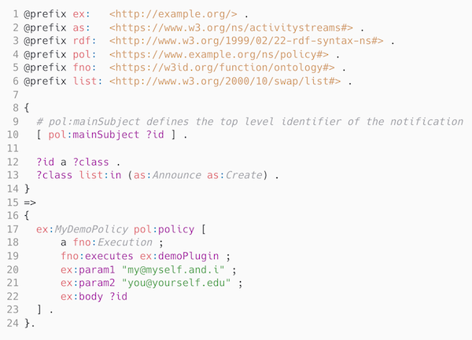

# Koreografeye Demonstration

This is a demonstration how to run the Koreografeye reasoner.

## Installation

npm install koreografeye -g 

## Package content

- `in/` : an input directory for RDF resources
- `in/demo.ttl` : an example input RDF resource
- `err/` : an error directory for failed RDF resources
- `out/` : an output directory for successful processed RDF resources
- `rules/` : a directory containing zero or more N3 policy files
- `rules/*.n3` : example N3 policy files
    - `rules/demo.n3` : a policy that starts a demo policy
    - `rules/email.n3` : a policy that request sending an email
    - `rules/ldn.n3` : a policy that request sending an [LDN](https://www.w3.org/TR/ldn/) notification
    - `rules/ntfy.n3` : a policy that request to send a [Ntfy](https://ntfy.sh) notifiaction

## Example N3 policy

An N3 policy can contain any valid [Notation3](https://w3c.github.io/N3/spec/) (N3) rule. The premise of the N3 rule should match the RDF resource one is interested in. The conclusion of the N3 rule should specify one or more policies. The policy has the format:

```(turtle)
<PolicyName> pol:policy <PolicyDescription>
```

where:

- `<PolicyName>` is a unique identifier for the policy
- `<PolicyDescription>` is an FnO description of the required policy

File: `rules/demo.n3`



- Lines 1-6 define the namespace prefixes that are used in the rule
- Line 10 binds `?id` to the main subject of the input RDF resource
    - This information is generated by Koreographeye and inject as a blank node into the RDF document `[ pol:mainSubject <id> ]`.
- Lines 12-13 binds `?class` to the class of the main subject and demands it is an `as:Announce` or an `as:Create`
- Lines 17-23 define the policy that should be executed when a `?id` and `?class` binding is found
    - Each policy **must** have a named identifier: `ex:MyDemoPolicy` was chosen for this example
    - `pol:policy` defines the required policy using the [FnO](https://fno.io/spec/) vocabulary
      - A policy defines at least an `fno:executes` with a name of a policy interface
      - This interface can have zero or more arguments. In this example the arguments are:
          - `ex:param1`
          - `ex:param2`
          - `ex:body`

## Demonstration

Process all RDF resource in the `in` directory against one `demo` rule.

Step 1. Run the orchestrator component

```
npx orch --info --keep --in in --out out --err err rules/demo.n3
```

or shorter

```
npm run orch:demo
```

This will generate a `out/demo.ttl` file as output containing the input RDF resource plus injected policies.

Step 2. Run the policy executor against the output of step 1

```
npx pol --info --keep --single out/demo.ttl
```

or shorter

```
npm run pol
```

This will return some debugging output from the `DemoPlugin` implementation of the demo policy.

## Configuration

The [ComponentsJS](https://componentsjs.readthedocs.io/en/latest/) configuration file `config.jsonld` defined all start up parameters of the Koreografeye components.

- `urn:koreografeye:reasonerInstance` contains arguments to pass to the internal [Eye](https://github.com/eyereasoner/eye) reasoner. On our example we make use of the [EyeJS](https://github.com/eyereasoner/eye-js) implementation.
- `http://example.org/demoPlugin` defines the demo policy, `demoPlugin` . The Koreografeye plugin `DemoPlugin` is an implementation of this policy.
- `http://example.org/sendEmail` defines the startup parameters of the `sendEmail` policy. The Koreografeye plugin `SendEmailPlugin` is an implementation of this policy.
- `http://example.org/sendNotify` defines the startup parameters of the `sendNotify` policy. The Koreografeye plugin `SendNotificationPlugin` is an implementation of this policy.
- `http://example.org/sendNtfy` defined the startup parameters of the `sendNtfy` policy. The Koreografete plugin `SendNtfyPlugin` is an implementation of this policy

## More documentation

```
npx orch --help
```

```
npx pol --help
```